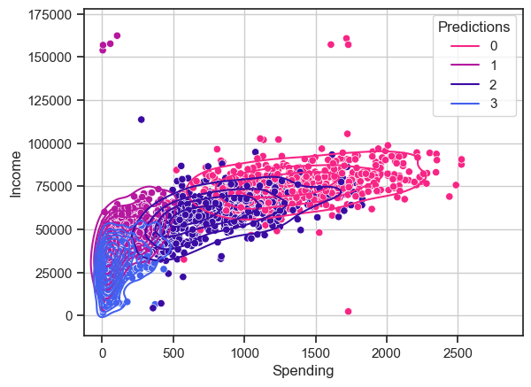
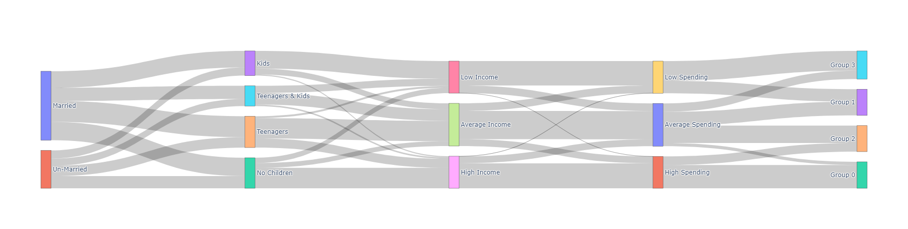
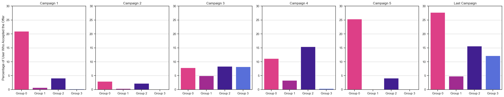

# Customer Segmentation Analysis

## Goal of the Project
In this project, I aim to segment customer personalities based on their purchasing behavior. 

Dataset: https://www.kaggle.com/datasets/imakash3011/customer-personality-analysis 

## Methods
- Data cleaning and preprocessing
- Feature engineering
- Using K-Means clustering to obtain customer Segmentation
- Profiling and validating clusters using visualizations
- Linear regression to predict 2 year spending amount based on customer profile
- Logistic regression to predict which channel is a new customer most likely to make a purchase from

## Results
The data can be segmented into 4 customer groups based on K-Means clustering.

| Group Name| Income Group| Spending Group| Campaign Accpetance| Highest Spending Category|
| ------------- |:-------------|:-----|:----|:---|
| Group 0      | High | High | Last Campaign | Wines|
| Group 1      | Average|   Low | Campaign 3| Wines|
| Group 2| Average     |    Average | Campaign 4| Wines|
| Group 3 | Low | Low| Last Campaign | Meat|

Image showing the distribution of user categories based on income and spending.

#### Accpetance of campaigns
Group 0 has the highest acceptance rate for most of the campaigns. Furthermore, Group 1 has the lowest acceptance rate for most of the campaigns. Finally, it appears that the last campaign had the highest acceptance rate overall.

#### Predictive modelling
- Built a linear regression model to predict spending amount based on user profile with an **accuracy of 83.33%**.
- Built a Logistic regression classifier to find which channel a new user is most likely to make a purchase from. The classifier has an **F1-score of 0.659**.

#### Addtional Analysis
- Used PCA to identify which features contribute the most to the data.
- Used SHAP analysis to identify what the most important features used the K-Means model to identify the customer segments.